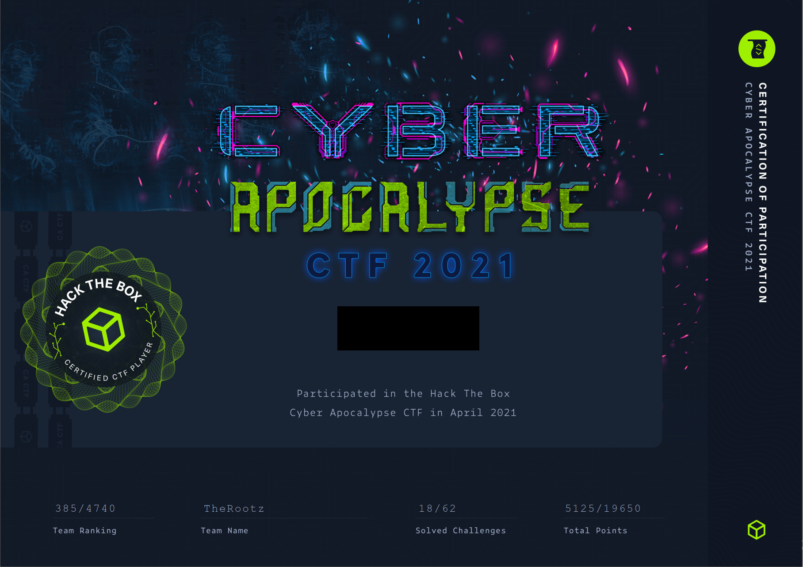

# Cyber Apocalypse 2021

Cyber Apocalypse was a challenging CTF in April, 2021 consisting of many categories: Web, Crypto, Reversing, and more. I wanted to improve my web exploit capabilities, so I focused primarily on that category and assisted elsewhere as my team needed. We solved 18 of the 62 available challenges and I was able to personally tackle all 1 star and 2 star web challenges.

